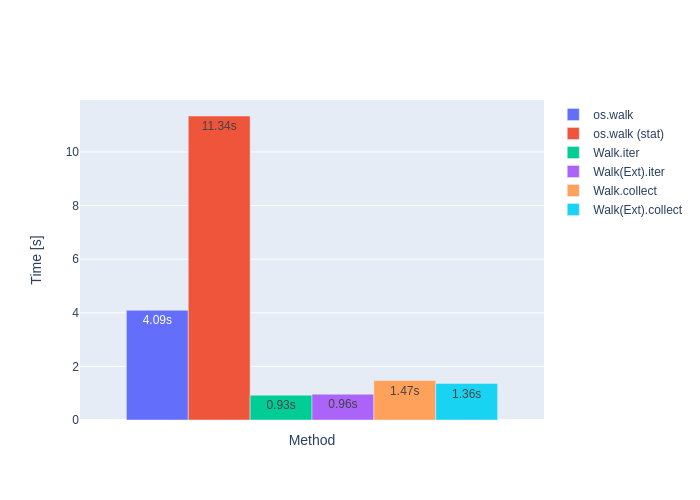
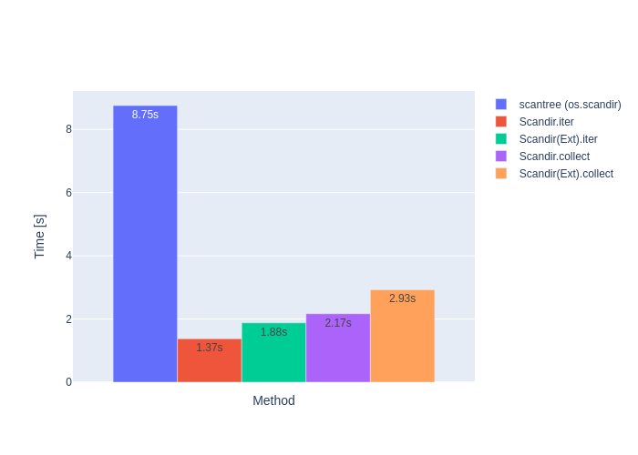
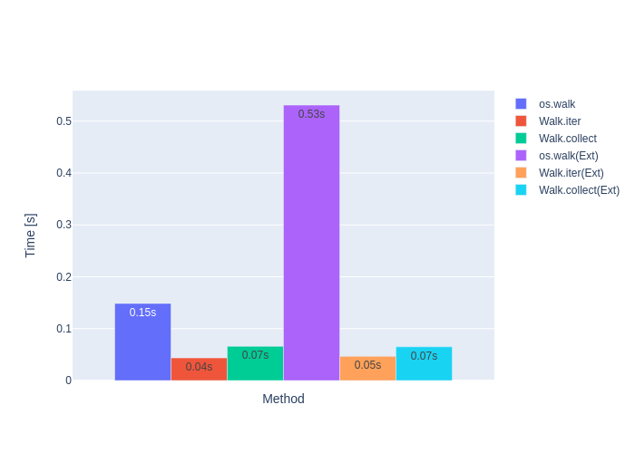
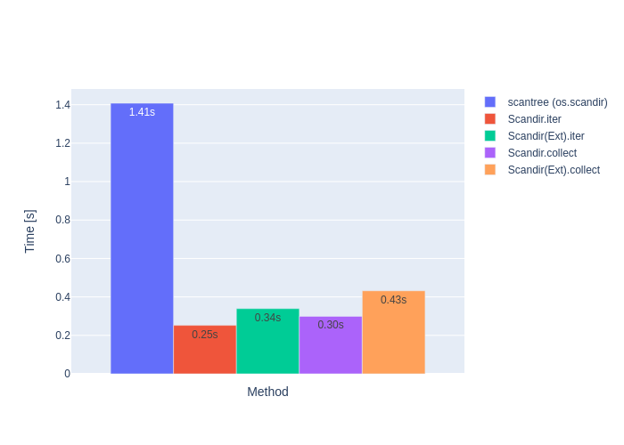
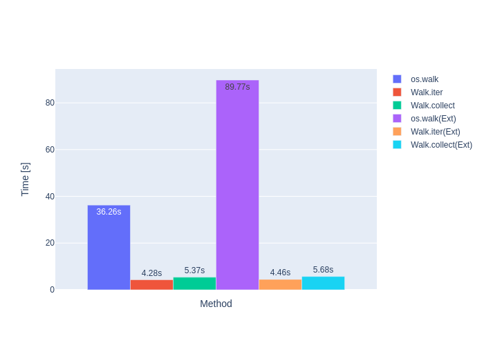
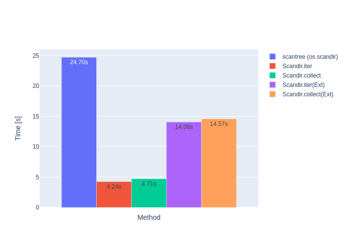
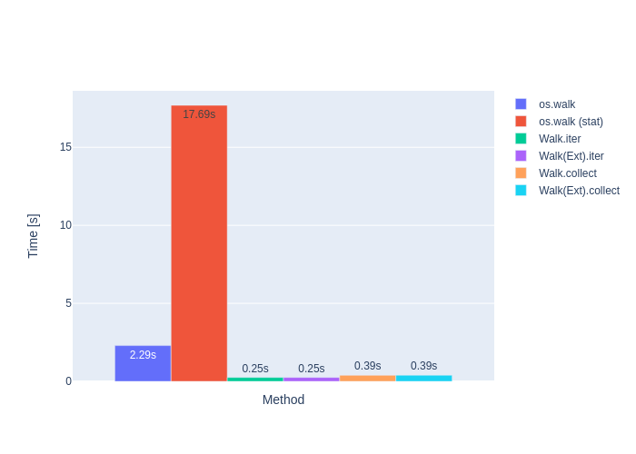
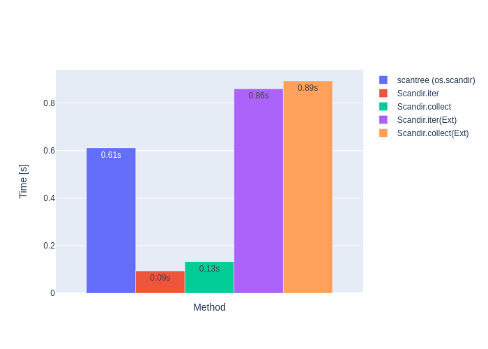

# Benchmarks

Benchmarking code see [benches/benchmark.py](../benches/benchmark.py)

In the below table the line **Walk.iter** returns comparable
results to os.walk.

## Linux with Tower Ryzen 5 2400G @ 3.6GHz (4/8 cores) and Samsung SSD 960 EVO 250GB (NVME, EXT4)

### Directory /usr with

- 45060 directories
- 388518 files
- 34937 symlinks
- 177 hardlinks
- 0 devices
- 0 pipes
- 23.16GB size and 24.02GB usage on disk

|   Time [s] | Method                               |
|------------|--------------------------------------|
|   0.931535 | Count.collect                        |
|   1.48159  | Count(ReturnType=Ext).collect        |
|   4.09372  | os.walk (Python 3.12.2)              |
|  11.3418   | os.walk (stat) (Python 3.12.2)       |
|   0.925864 | Walk.iter                            |
|   0.96183  | Walk(ReturnType=Ext).iter            |
|   1.47056  | Walk.collect                         |
|   1.36103  | Walk(ReturnType=Ext).collect         |
|   8.75475  | scantree (os.scandir, Python 3.12.2) |
|   1.37387  | Scandir.iter                         |
|   1.87683  | Scandir(ReturnType=Ext).iter         |
|   2.16722  | Scandir.collect                      |
|   2.92552  | Scandir(ReturnType=Ext).collect      |

Walk.iter **~4.4 times faster** than os.walk.  
Walk(Ext).iter **~11.8 times faster** than os.walk(stat).  
Scandir.iter **~6.4 times faster** than scantree(os.scandir).

#### Walk /usr

#### Scandir /usr

### Directory linux-5.9 with

- 4711 directories
- 69973 files
- 38 symlinks
- 1.08GB size and 1.23GB usage on disk

|   Time [s] | Method                               |
|------------|--------------------------------------|
|   0.153199 | Count.collect                        |
|   0.249917 | Count(ReturnType=Ext).collect        |
|   0.448813 | os.walk (Python 3.12.2)              |
|   1.64711  | os.walk (stat) (Python 3.12.2)       |
|   0.149128 | Walk.iter                            |
|   0.143961 | Walk(ReturnType=Ext).iter            |
|   0.213981 | Walk.collect                         |
|   0.211384 | Walk(ReturnType=Ext).collect         |
|   1.4078   | scantree (os.scandir, Python 3.12.2) |
|   0.251858 | Scandir.iter                         |
|   0.339001 | Scandir(ReturnType=Ext).iter         |
|   0.298834 | Scandir.collect                      |
|   0.431882 | Scandir(ReturnType=Ext).collect      |

Walk.iter **~3.0 times faster** than os.walk.  
Walk(Ext).iter **~11.4 times faster** than os.walk(stat).  
Scandir.iter **~5.6 times faster** than scantree(os.scandir).

#### Walk linux-5.9

#### Scandir linux-5.9

## Windows 10 with Laptop Core i7-11850H @ 2.5GHz (8/16 cores) and Samsung MZVLB1T0HBLR-000H1 (NVME, NTFS)

### Directory C:\Windows with

- 165926 directories
- 316866 files
- 35364 hardlinks
- 39.68GB size and 40.53GB usage on disk

|   Time [s] | Method                               |
|------------|--------------------------------------|
|    10.1644 | Count.collect                        |
|    38.04   | Count(ReturnType=Ext).collect        |
|    99.0955 | os.walk (Python 3.12.2)              |
|   238.835  | os.walk (stat) (Python 3.12.2)       |
|    10.0431 | Walk.iter                            |
|    10.007  | Walk(ReturnType=Ext).iter            |
|    11.8813 | Walk.collect                         |
|    11.8674 | Walk(ReturnType=Ext).collect         |
|    66.8014 | scantree (os.scandir, Python 3.12.2) |
|    10.1068 | Scandir.iter                         |
|    37.7527 | Scandir(ReturnType=Ext).iter         |
|    11.3297 | Scandir.collect                      |
|    38.5138 | Scandir(ReturnType=Ext).collect      |

Walk.iter **~9.9 times faster** than os.walk.  
Walk(Ext).iter **~23.9 times faster** than os.walk(stat).  
Scandir.iter **~6.6 times faster** than scantree(os.scandir).

#### Walk C:\Windows

#### Scandir C:\Windows

### Directory linux-5.9 with

- 4712 directories
- 69998 files
- 1.08GB size and 1.23GB usage on disk

|   Time [s] | Method                               |
|------------|--------------------------------------|
|   0.237721 | Count.collect                        |
|   1.86161  | Count(ReturnType=Ext).collect        |
|   2.29283  | os.walk (Python 3.12.2)              |
|  17.6911   | os.walk (stat) (Python 3.12.2)       |
|   0.247534 | Walk.iter                            |
|   0.250716 | Walk(ReturnType=Ext).iter            |
|   0.386362 | Walk.collect                         |
|   0.39245  | Walk(ReturnType=Ext).collect         |
|   1.96715  | scantree (os.scandir, Python 3.12.2) |
|   0.26433  | Scandir.iter                         |
|   1.86403  | Scandir(ReturnType=Ext).iter         |
|   0.375734 | Scandir.collect                      |
|   2.08924  | Scandir(ReturnType=Ext).collect      |

Walk.iter **~9.3 times faster** than os.walk.  
Walk(Ext).iter **~70.6 times faster** than os.walk(stat).  
Scandir.iter **~7.4 times faster** than scantree(os.scandir).

#### Walk linux-5.9

#### Scandir linux-5.9

