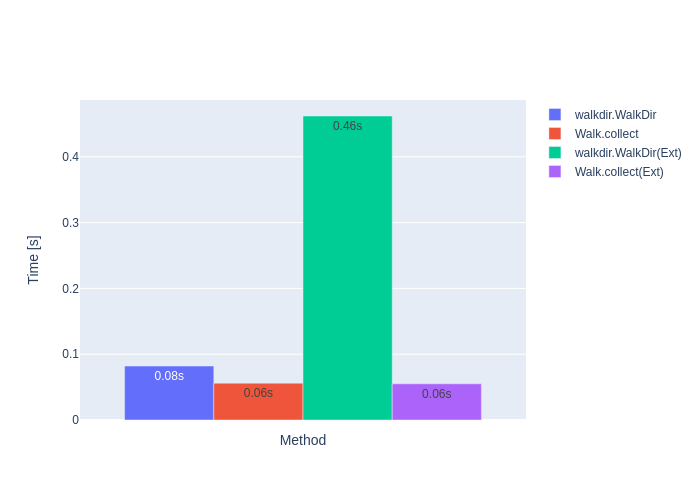
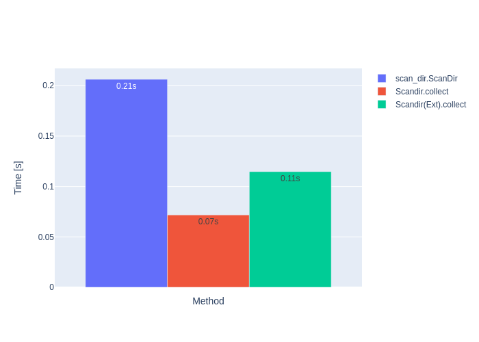
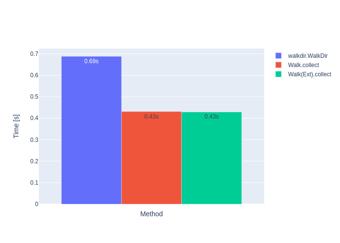
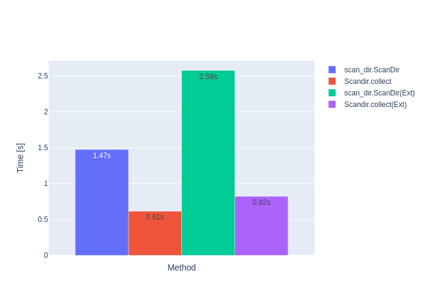
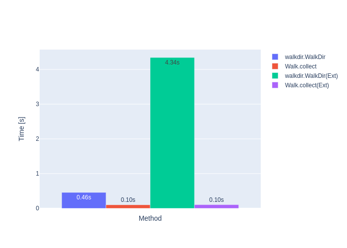
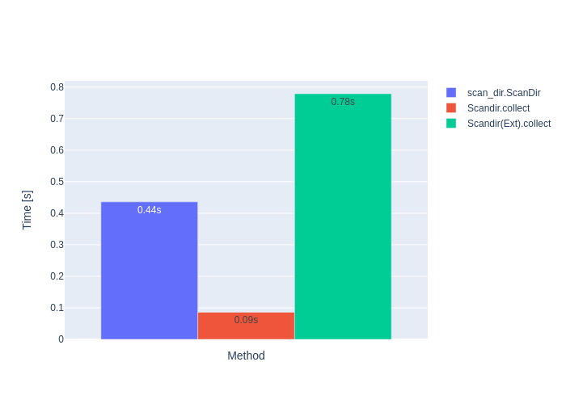
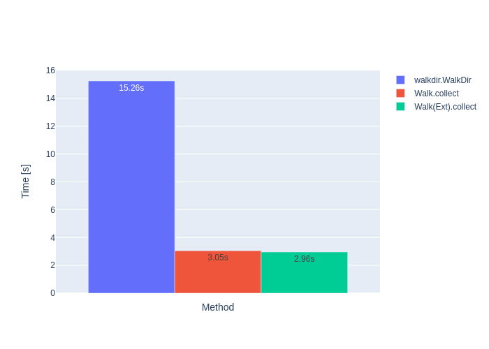
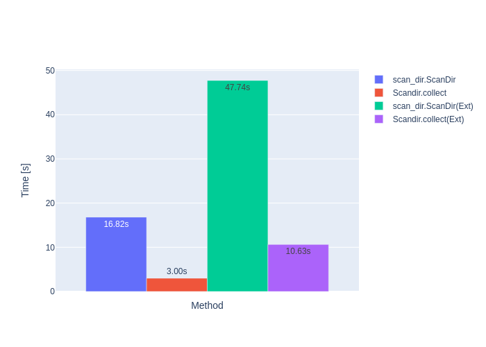

# Benchmarks

Benchmarking code see [benches/benchmark.rs](../benches/benchmark.rs)

**(Ext)** means reading extended metadata to be able to identify hardlinks and special file types,
like pipes, devices.

## Linux with Tower Ryzen 5 2400G @ 3.6GHz (4/8 cores) and Samsung SSD 960 EVO 250GB (NVME, EXT4)

### Directory linux-5.9 with

- 4711 directories
- 69973 files
- 38 symlinks
- 1.08GB size and 1.23GB usage on disk

#### Count linux-5.9

|   Time [s] | Method                               |
|------------|--------------------------------------|
|   0.046    | Count.collect                        |
|   0.081    | Count.collect(Ext)                   |

#### Walk linux-5.9

|   Time [s]    | Method                            |
|---------------|-----------------------------------|
|   0.082       | walkdir.WalkDir                   |
|   0.056       | Walk.collect                      |
|   0.462       | walkdir.WalkDir(Ext)              |
|   0.055       | Walk.collect(Ext)                 |

Walk.collect **~1.5 times faster** than walkdir.WalkDir.  
Walk.collect(Ext)  **~8.4 times faster** than walkdir.WalkDir(Ext).  

#### Scandir linux-5.9

|   Time [s]    | Method                            |
|---------------|-----------------------------------|
|   0.199       | scan_dir.ScanDir                  |
|   0.073       | Scandir.collect                   |
|   0.383       | scan_dir.ScanDir(Ext)             |
|   0.116       | Scandir.collect(Ext)              |

Scandir.collect **~2.7 times faster** than scan_dir.ScanDir.  
Scandir.collect(Ext) **~3.3 times faster** than scan_dir.ScanDir(Ext).

### Directory /usr with

- 45060 directories
- 388518 files
- 34937 symlinks
- 177 hardlinks
- 0 devices
- 0 pipes
- 23.16GB size and 24.02GB usage on disk

#### Count /usr

|   Time [s] | Method                               |
|------------|--------------------------------------|
|   0.306    | Count.collect                        |
|   0.515    | Count.collect(Ext)                   |

#### Walk /usr

|   Time [s] | Method                               |
|------------|--------------------------------------|
|   0.671    | walkdir.WalkDir                      |
|   0.405    | Walk.collect                         |
|   2.829    | walkdir.WalkDir(Ext)                 |
|   0.404    | Walk.collect(Ext)                    |

Walk.collect **~1.7 times faster** than walkdir.WalkDir.  
Walk.collect(Ext)  **~7.0 times faster** than walkdir.WalkDir(Ext).

#### Scandir /usr

|   Time [s] | Method                               |
|------------|--------------------------------------|
|   1.474    | scan_dir.ScanDir                     |
|   0.615    | Scandir.collect                      |
|   2.575    | scan_dir.ScanDir(Ext)                |
|   0.822    | Scandir.collect(Ext)                 |

Scandir.collect **~2.4 times faster** than scan_dir.ScanDir.  
Scandir.collect(Ext) **~3.1 times faster** than scan_dir.ScanDir(Ext).

## Windows 10, Laptop Core i7-11850H @ 2.5GHz (8/16 cores), Samsung MZVLB1T0HBLR-000H1 (NVME, NTFS)

### Directory linux-5.9 with

- 4712 directories
- 69998 files
- 1.08GB size and 1.23GB usage on disk

#### Count linux-5.9

|   Time [s] | Method                               |
|------------|--------------------------------------|
|   0.070    | Count.collect                        |
|   0.826    | Count.collect(Ext)                   |

#### Walk linux-5.9

|   Time [s]    | Method                            |
|---------------|-----------------------------------|
|   0.456       | walkdir.WalkDir                   |
|   0.100       | Walk.collect                      |
|   4.343       | walkdir.WalkDir(Ext)              |
|   0.103       | Walk.collect(Ext)                 |

Walk.collect **~4.6 times faster** than walkdir.WalkDir.  
Walk.collect(Ext)  **~42.2 times faster** than walkdir.WalkDir(Ext).

#### Scandir linux-5.9

|   Time [s] | Method                               |
|---------------|-----------------------------------|
|   0.707       | scan_dir.ScanDir                  |
|   0.107       | Scandir.collect                   |
|   7.483       | scan_dir.ScanDir(Ext)             |
|   0.864       | Scandir.collect(Ext)              |

Scandir.collect **~6.6 times faster** than scan_dir.ScanDir.  
Scandir.collect(Ext) **~8.7 times faster** than scan_dir.ScanDir(Ext).

### Directory C:\Windows with

- 165926 directories
- 316866 files
- 35364 hardlinks
- 39.68GB size and 40.53GB usage on disk

#### Count C:\Windows

|   Time [s] | Method                               |
|------------|--------------------------------------|
|   3.018    | Count.collect                        |
|  11.622    | Count.collect(Ext)                   |

#### Walk C:\Windows

|   Time [s] | Method                               |
|---------------|-----------------------------------|
|  15.512       | walkdir.WalkDir                   |
|   0.046       | Walk.collect                      |
|   0.090       | walkdir.WalkDir(Ext)              |
|   0.961       | Walk.collect(Ext)                 |

Walk.collect **~5.0 times faster** than walkdir.WalkDir.  
Walk.collect(Ext)  **~5.2 times faster** than walkdir.WalkDir.  

#### Scandir C:\Windows

|   Time [s]    | Method                            |
|---------------|-----------------------------------|
|  16.818       | scan_dir.ScanDir                  |
|   2.999       | Scandir.collect                   |
|  47.740       | scan_dir.ScanDir(Ext)             |
|  10.632       | Scandir.collect(Ext)              |

Scandir.collect **~5.6 times faster** than scan_dir.ScanDir.  
Scandir.collect(Ext) **~4.5 times faster** than scan_dir.ScanDir.

